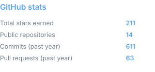
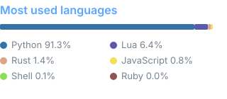

## Hi, I'm Mo 👋

I build things for people who live in their terminal —
Neovim and org-mode plugins, and lately tooling for the age of AI coding agents.

### 🔨 Building

- **[opentab](https://github.com/hamidi-dev/opentab)** — browse your AI coding spend in the terminal. OpenCode, Claude Code, Codex & more.
- **[gitrivia](https://github.com/hamidi-dev/gitrivia)** — git forensics: uncover your repo's structure and secrets.

### 🌱 Neovim & org-mode

- **[org-super-agenda.nvim](https://github.com/hamidi-dev/org-super-agenda.nvim)** — a customizable agenda view for orgmode.
- **[org-list.nvim](https://github.com/hamidi-dev/org-list.nvim)** — toggle between different kinds of lists.
- **[kaleidosearch.nvim](https://github.com/hamidi-dev/kaleidosearch.nvim)** — colorize multiple search terms in distinct colors.

